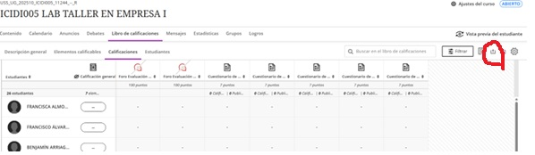
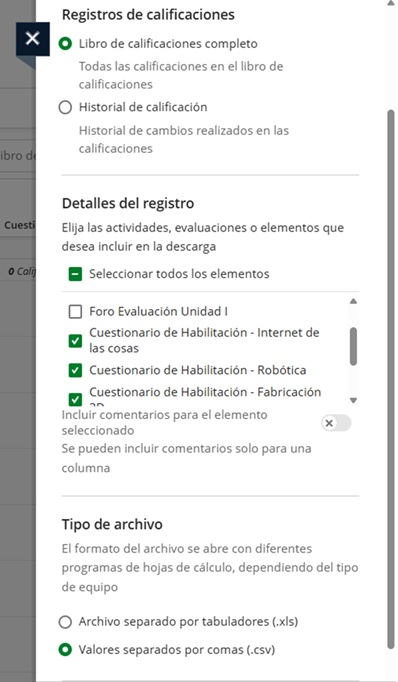

<h1> Documentación</h1>
 
1-	Pinchar la opción Libro de calificaciones

   

2-	Pinchar la opción descargar libro de calificaciones

)

3-	En el apartado de Detalles del registro selecciona solo los habilitadores tecnológicos (5 cuestionarios) y en la opción de Tipo de archivo seleccionar la opción Valores separados por coma (.csv)

)
